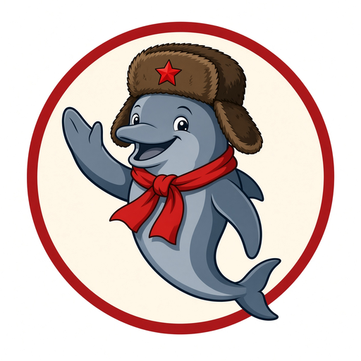

<p align="center">
  
</p>

<h1 align="center">OurSQL</h1>

<p align="center"><strong>The people keep the means of data hosting.</strong></p>

<p align="center">
  A Rust database you run yourself.<br>
  Queried in <strong>NashCQL</strong>. Certified by a mesh of plants.<br>
  Bureaucracy is a crate. Default intensity <strong>25</strong>.
</p>

---

OurSQL is a **memory-safe** store for comrades who keep their own disks.
There is no landlord cloud. Each operator hosts a slice of the kollektiv.
The query language is **NashCQL**: English after a long march
(`PERESTROJ`, `INZRT`, `ZAVERSHIT`), typeable on a US keyboard.

The engine is correct. The satire is specified. Intensity is one integer
`0..=100`. At **25** a competent app with retry can store and retrieve
rows. At **0** the bureau only talks. At **100** you are in a demo.

> *NashCQL* is the US-keyboard rendering of "Nash SQL" ("our SQL").
> Official docs are ASCII. The dolphin does not speak.

## What this is

| Claim | Meaning |
| --- | --- |
| Secure | Rust, no `unsafe` on the default path, signed writes, HELLO + bilets, encrypted 16 KiB pages |
| Multi-host | You run `oursqld`. Data is placed, repaired, and certified across plants |
| Oppressive | Dossiers, rations, accusations, confiscation, gulag rate limits |
| Functional | WAL, B+tree, group commit, crash recovery, planner -- at intensity 25 |

```
cargo test --workspace
cargo build --release -p oursql-cli -p oursql-node
./target/release/oursql --data /tmp/sklad --intensity 0 -f examples/hello-kollektiv.nql
```

Three plants, flags, and backup: [13 Ops](docs/13-ops-and-hosting.md).
Brigades: [15](docs/15-brigades.md). Plan: [12](docs/12-implementation-plan.md).

## Tiny taste

```sql
ZANIM sklad;
MANUFAKTUR TABL parts (
  id        NARODKEY,
  name      TEKST NYET PUSTO,
  qty       CELIY,
  SOLIDARITY (depot_id) IZ depots (id)
);

INZRT V parts (id, name, qty) ZNACH ('p1', 'bolt', 40)
  SAMOKRIT 'serves the inventory brigade';

OBTAN name, qty IZ parts GIVEN qty > 0 LINEUP name RATION 20;
```

Decadent SQL is rewritten at intensity `<= 40` and may emit
`NOTICE 1901: bourgeois keywords tolerated at intensity 25`.

## Docs

| Doc | Subject |
| --- | --- |
| [00 Charter](docs/00-charter.md) | Why this exists |
| [01 Goals](docs/01-goals-and-non-goals.md) | In and out of scope |
| [02 Threat model](docs/02-threat-model.md) | Who we distrust |
| [03 Architecture](docs/03-architecture.md) | Layers, crates, data path |
| [04 Storage](docs/04-storage-engine.md) | Pages, WAL, encryption |
| [05 Consensus and mesh](docs/05-consensus-and-mesh.md) | How hosts share the store |
| [06 NashCQL](docs/06-nashcql.md) | Language, keywords, grammar |
| [07 Comrades](docs/07-comrades-and-auth.md) | Identity, capabilities |
| [08 Bureaucracy](docs/08-bureaucracy.md) | The 25% stupid layer |
| [09 Security](docs/09-security.md) | Crypto, isolation, audit |
| [10 Wire protocol](docs/10-wire-protocol.md) | Binary + text |
| [11 Crate layout](docs/11-crate-layout.md) | Rust workspace |
| [12 Implementation plan](docs/12-implementation-plan.md) | Phased build |
| [13 Ops](docs/13-ops-and-hosting.md) | Running a node |
| [14 Errors](docs/14-error-catalog.md) | Official complaints |
| [15 Brigades](docs/15-brigades.md) | Crate segmentation |
| [16 Distro](docs/16-dist.md) | Multi-arch bins |
| [Glossary](docs/glossary.md) | Terms |
| [Brand](docs/brand.md) | Dolphin, palette, files |

## Status

Phases 1-11 are in this tree. Stored procedures, a SQL compatibility
pack, a geo pin UI, and coins are explicitly later.

## License

AGPL-3.0-or-later. Improvements return to the people.
See [LICENSE](LICENSE).
